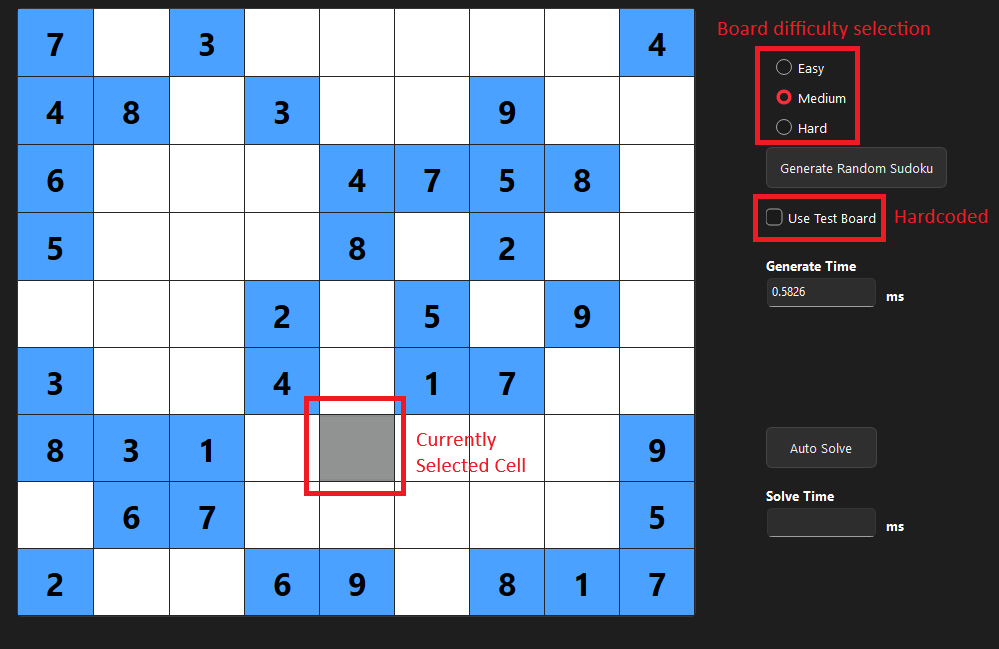
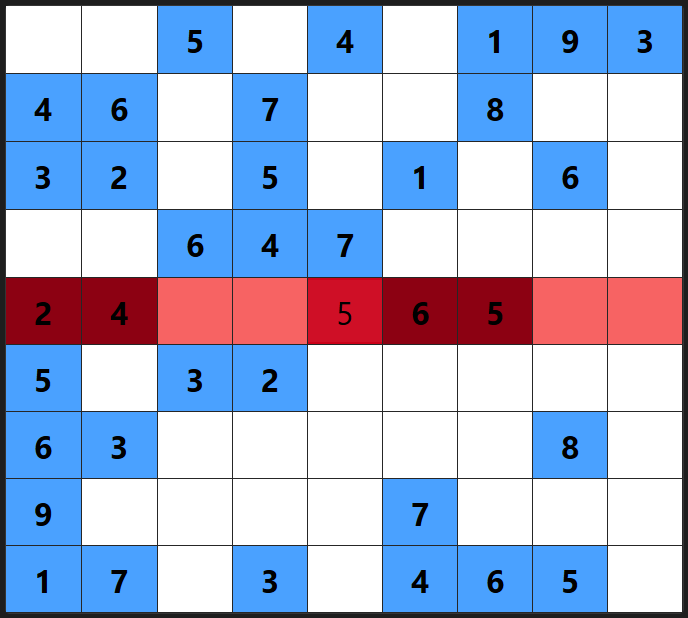
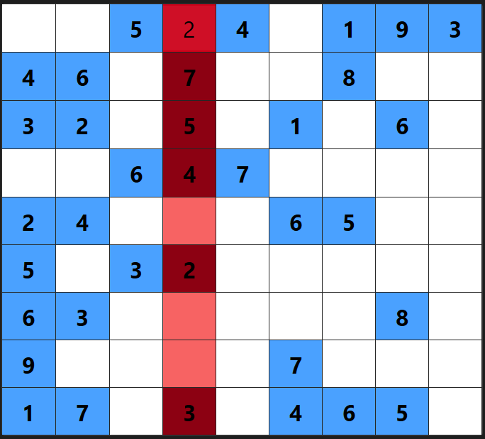
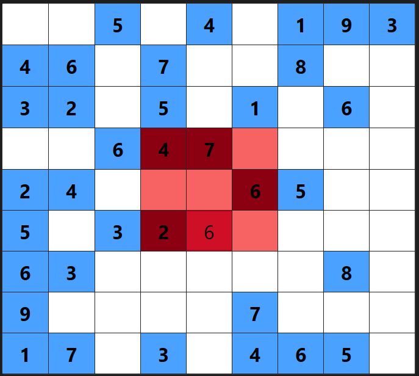

# Sudoku
<p align="center">
  
</p>

## About Sudoku
This is my take on the Sudoku game, a mathematical puzzle sourced from one of the many findings of Leonhard Euler.

Since I can remember, my Opa (grandfather) challenged me with problems you would find in the newspaper, ranging from 
crosswords to another interesting numerical game, [Kakuro](https://www.kakuroconquest.com/). Sudoku was a staple we 
often worked to solve.

One issue I came across when solving puzzle on paper, was accidentally including an invalid move early one, which would
eventually unravel my solution near the end (if I didn't give up!). Therefore, I created this desktop Sudoku implementation
to assist the user in wasting little brain power on checking validation, and prioritising their next move!

This Sudoku implementation features backtracking algorithms used to solve and generate puzzles of varied difficulty.

### Solving Algorithm

The current solving algorithm uses a backtracking approach. The algorithm will scan through the array, and wherever a cell
is unfilled, the algorithm will test a new value bewteen 1 and 9, inclusive. 

It will then validate this desicision, checking if the Sudoku meets the requirements of at most 1 of each integer between 1
and 9 in each row, column and box. Invalid states result in a 'backtrack', undoing the most recent decision and trying another.

### Random Puzzle Generation Algorithm
The generatin algorithm utilises similar methods to the solving algorithm. 

It begins by randomly selecting and filling cells while maintaining the valid Sudoku properties. After populating an entire
blank slate, we are left with a completed Sudoku. 

We then "dig" away at the completed Sudoku, removing elements until we have the desired number of starting clues which govern
the easy, medium and hard puzzle difficulties. A property of official Sudoku problems is having a unique solution, meaning, there
is only one permutation of the 81 cells that can complete the grid. While digging into the grid, we ensure there maintains a unqiue
solution after every deletion, also using backtracking to reverse invalid deletions.

### Built With
Sudoku has been built with:

* [![C++][cpp]][cpp-url]
* [![Qt][qt]][qt-url]


## Getting Started

### Prerequisites
If building and modifying the project:
* Qt 6
* C++ Compiler
* Git


### Installation Options

#### Qt Project
1. Clone the repo
   ```sh
   git clone https://github.com/santos-eng/Sudoku.git
   ```
2. Open Qt Creator and open project by clicking on the project file.
3. Configure the project depending on your system.
4. Click run to start the project. 

#### .exe File (Windows Only)
1. Download the latest release ZIP file which contains the executable.
2. Extract the folder to any location on your computer.
3. Double click the `Sudoku.exe` file to run.

## Usage


### Navigation
<p align="center">
  
</p>

- The shaded cell on the grid represents your currently selected prosition.
    - Navigate the cells using the arrow keys or select by clicking on desired cell.
- Enter a valid number 1 through 9, using 0 to clear a cell.
- The top right radio buttons determine puzzle difficulty.
- Generate a new puzzle with the corresponding button.
    - Default generation is random with difficulty determined by the radio buttons.
    - Using the test boards checkbox selects a hardcoded Sudoku puzzle.
- Both puzzle generation and auto solve functionality have corresponding timers.

### Validation
There are three cases for Sudoku violations:

#### Row Violation
There are duplicate numbers in the range [1,9] in the same row:
<p align="center">
  
</p>

#### Column Violation
There are duplicate numbers in the range [1,9] in the same column:
<p align="center">
  
</p>

#### Box Violation
There are duplicate numbers in the range [1,9] in the same box:
<p align="center">
  
</p>

## Future Improvements
- [x] MVP
- [ ] Test puzzle generation speed increase using single bit setting instead of reloading entire board on invalid boards.
- [ ] Add the 'most-constrained' solving algorithm
- [ ] Player solve timer
- [ ] Last 5 solve average time for player and autosolver
    - [ ] Compare different solving algorithms.
- [ ] Light mode / dark mode addition
- [ ] Look into X-Wing solve pattern


[cpp]: https://img.shields.io/badge/C++-%2300599C.svg?logo=c%2B%2B&logoColor=white
[cpp-url]: https://cplusplus.com/

[qt]: https://img.shields.io/badge/Qt-2CDE85?logo=Qt&logoColor=fff
[qt-url]: https://www.qt.io/
